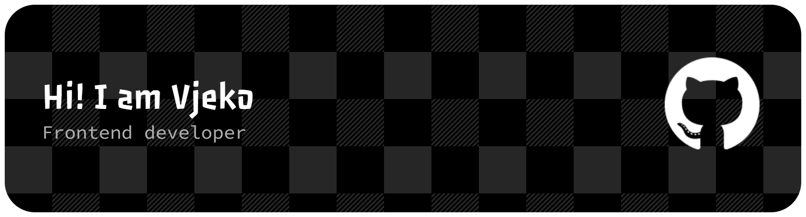

# 👋 Hey, I'm Vjeko

Frontend developer focused on building clean, scalable web apps — and slowly exploring how AI can become a real part of the development workflow, not just a tool on the side.

Based in Zagreb 🇭🇷

---

## 🚀 What I'm Focused On

Right now I'm all-in on improving my skills and building a strong foundation in:

- ⚛️ React & modern frontend architecture
- 🧠 TypeScript for safer, scalable code
- 🔌 Connecting frontend with real-world APIs
- 🤖 Exploring how AI tools (ChatGPT, Claude, Copilot) actually impact developer productivity

---

## 🛠️ Tech Stack

**Frontend**
- React
- TypeScript, JavaScript
- HTML, CSS (Sass, Tailwind)

**Backend**
- Node.js

**Databases**
- PostgreSQL, MySQL, MongoDB

---

## 💡 What I'm About

I enjoy building things that are **clean, intuitive, and actually useful** — not just technically correct.

Right now, I'm especially interested in:
- how developers work faster with AI
- structuring scalable frontend apps
- bridging the gap between learning and real-world projects

Still early in my journey, but focused on becoming the kind of developer who doesn’t just write code — but **builds systems that make sense**.

---

## 📈 What's Next

- Build and publish real-world projects
- Go deeper into full-stack development
- Explore AI-assisted workflows in real apps
